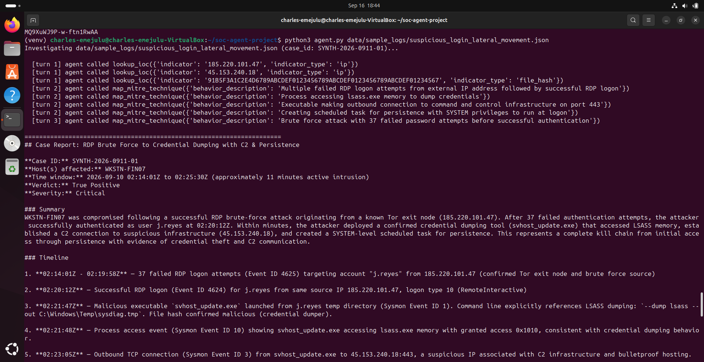
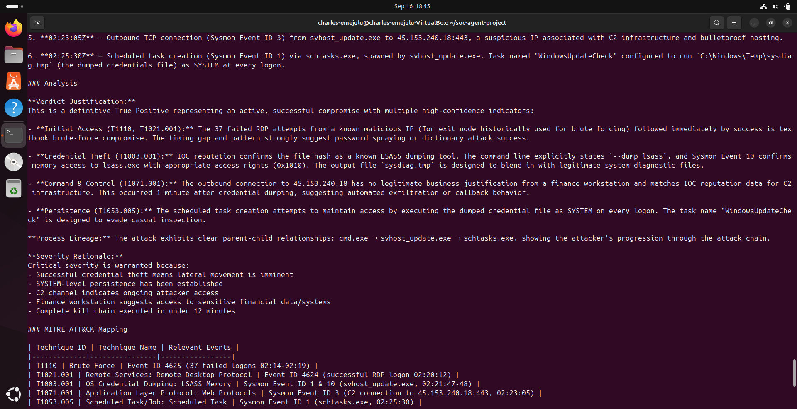
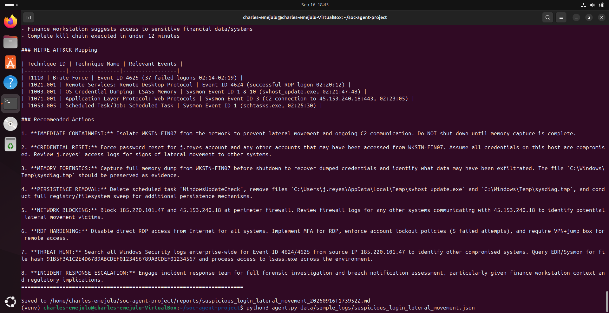
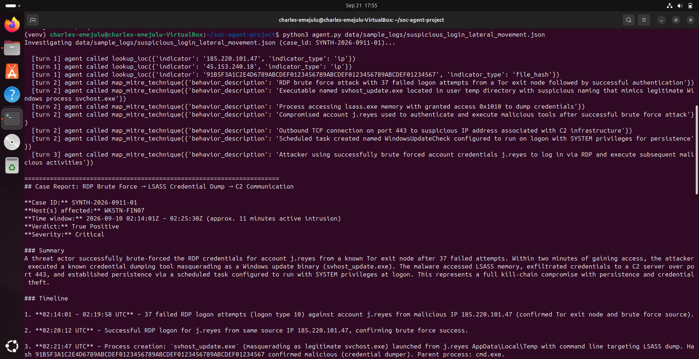
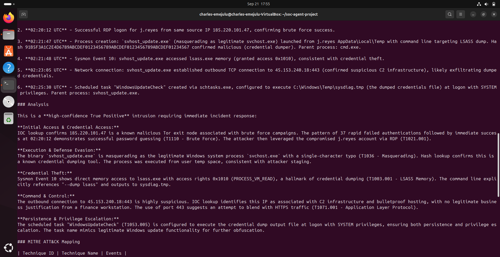
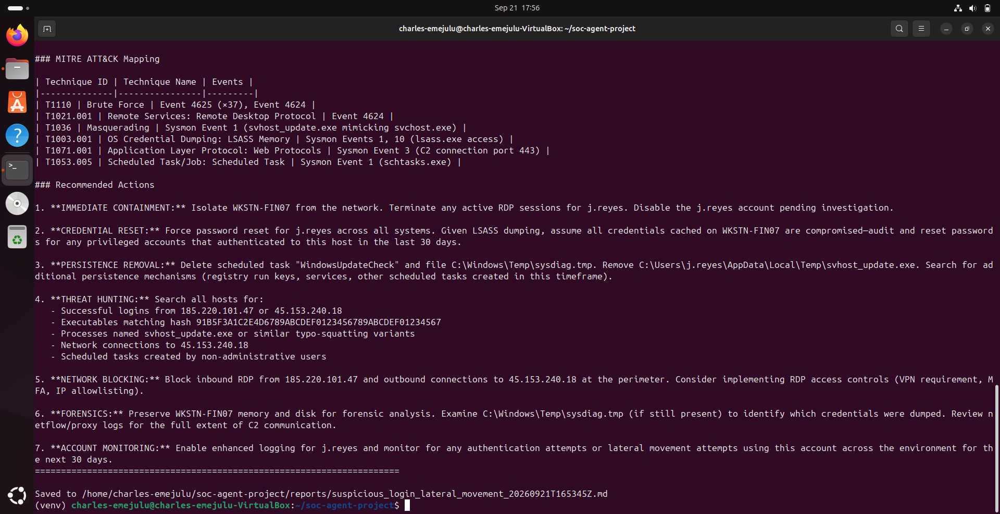

# SOC Triage-to-Case-Report Agent
 
An agent that takes raw Windows Security / Sysmon log events, investigates them the way a Tier 1 SOC analyst would, and produces a structured case report — the exact skill area (case reporting) this project was built to practise.
 
## How it works
 
1. `agent.py` loads a JSON log file and hands it to Claude along with a system prompt (`prompts/system_prompt.md`) that lays out the analyst workflow: read everything, connect events across the timeline, decide a verdict, map to MITRE ATT&CK, check IOC reputation, assign severity, recommend actions, then write the report in a fixed format.
2. Claude has two tools available:
   - `lookup_ioc` — checks reputation for an IP or file hash.
   - `map_mitre_technique` — maps a described behaviour to ATT&CK technique IDs.
   Both are currently **stubs** (canned data, no API keys needed) so the whole pipeline runs today. See "Making it real" below.
3. The agent loops: Claude calls tools as needed, gets results back, and eventually returns a final report instead of another tool call. `agent.py` detects that (no more `tool_use` blocks) and saves the report to `reports/`.
## Setup
 
```bash
cd soc-agent-project
pip install -r requirements.txt
export ANTHROPIC_API_KEY=sk-ant-...   # from console.anthropic.com/settings/keys
```
 
## Run it
 
```bash
python agent.py data/sample_logs/suspicious_login_lateral_movement.json
```
 
You'll see each tool call printed as it happens, then the final case report, which also gets saved to `reports/`.
 
## Checking the agent's work
 
`data/sample_logs/suspicious_login_lateral_movement.ANSWER_KEY.md` has the intended scenario and the ATT&CK techniques it maps to. Don't feed it to the agent — read it *after* the agent produces its report, and compare. This is how you'd validate any SOC automation before trusting it: check it against a case where you already know the right answer.
 
The sample log simulates: RDP brute force -> successful logon -> LSASS credential dumping via a masquerading binary -> outbound connection to a suspicious IP -> scheduled task persistence. A good report should flag all five stages and reach a True Positive / high severity verdict.
 
## Debugging in the open: a real iteration
 
The first full run against the sample log produced a strong report, correct verdict, correct severity, four of the five expected MITRE ATT&CK techniques, but missed two: **T1036 (Masquerading)**, the disguised filename `svhost_update.exe` mimicking the real `svchost.exe`, and **T1078 (Valid Accounts)**, the reuse of the brute-forced account after compromise. Checking the agent's own tool-call log showed why: it called `map_mitre_technique` for the obvious behaviours (the failed-logon burst, the LSASS dump, the C2 beacon, the scheduled task) but never asked about the filename at all. Not a tool bug, a reasoning gap, it simply never checked.
 
The fix was a targeted addition to `prompts/system_prompt.md`, explicitly instructing the agent to check unusual filenames against masquerading and reused credentials against Valid Accounts, rather than leaving it to notice on its own.
 
| | Before | After |
|---|---|---|
| T1110 Brute Force | ✅ | ✅ |
| T1021.001 Remote Services: RDP | ✅ | ✅ |
| T1003.001 OS Credential Dumping: LSASS Memory | ✅ | ✅ |
| T1071.001 Application Layer Protocol | ✅ | ✅ |
| T1053.005 Scheduled Task/Job | ✅ | ✅ |
| **T1078 Valid Accounts** | ❌ missing | ✅ caught |
| **T1036 Masquerading** | ❌ missing | ✅ caught, correctly tied to the exact filename |
 
Re-running against the same log with the updated prompt produced all seven techniques, each correctly tied to specific events, on the first attempt. Both reports (`examples/report_v1_before_fix.md` and `examples/report_v2_after_fix.md`) are kept in this repo as evidence, this is the actual review → diagnose → iterate → verify loop, not a staged example.
 
**Before the fix** (missing T1036 and T1078):
 



 
**After the fix** (all seven techniques caught):
 



 
## Making it real
 
Both tools are stubs on purpose, so you can demo the whole thing today without any paid API keys, then upgrade piece by piece:
 
- **`tools/ioc_lookup.py`**: swap the canned `_STUB_DATA` lookup for a real call to [VirusTotal](https://developers.virustotal.com/reference) or [AbuseIPDB](https://docs.abuseipdb.com/) (both have free tiers). The `TODO` comment in the file shows roughly where the real request goes — keep the same return shape and nothing else in the project needs to change.
- **`tools/mitre_mapping.py`**: swap the local keyword table for the real ATT&CK dataset, e.g. via the [`attackcti`](https://github.com/OTRF/ATTACK-Python-Client) package, which queries MITRE's official STIX data.
- **More log sources**: add more files to `data/sample_logs/`. Good next ones to pull in: [EVTX-ATTACK-SAMPLES](https://github.com/sbousseaden/EVTX-ATTACK-SAMPLES) (real captured Windows Event Logs from attack simulations, labelled by technique) for single-technique test cases, then Splunk's [BOTS dataset](https://github.com/splunk/attack_range) for a fuller multi-stage incident with a published answer key.
- **Real SIEM data**: once you have access to a live Sentinel/Splunk/Elastic instance (e.g. through a TryHackMe room or a lab environment), replace `load_log()` in `agent.py` with a query against that platform's API instead of reading a static JSON file.
## Project structure
 
```
soc-agent-project/
├── agent.py                    # main loop: load log -> call Claude -> handle tool calls -> save report
├── prompts/
│   └── system_prompt.md        # the analyst persona + report format
├── tools/
│   ├── tool_definitions.py     # Claude tool schemas + dispatch table
│   ├── ioc_lookup.py           # stub IOC reputation lookup
│   └── mitre_mapping.py        # stub MITRE ATT&CK mapping
├── data/sample_logs/           # synthetic + (later) real sample logs
├── examples/                   # before/after case reports kept as evidence (see "Debugging in the open" above)
├── screenshots/                # before-1/2/3.png and after-1/2/3.png, referenced in "Debugging in the open" above
├── reports/                    # generated case reports land here (gitignored — examples/ holds the ones worth keeping)
└── requirements.txt
```
 
## Why this project
 
Built to close a specific gap: after passing the TryHackMe SAL1 exam (48/48 correctly triaged alerts), case reporting was flagged as the next thing to sharpen. This turns that into something concrete for a cybersecurity portfolio — it shows both the SOC analyst thinking (what makes a good triage/report) and the ability to scope and build an agent around a real workflow, which is directly relevant to AI security work.